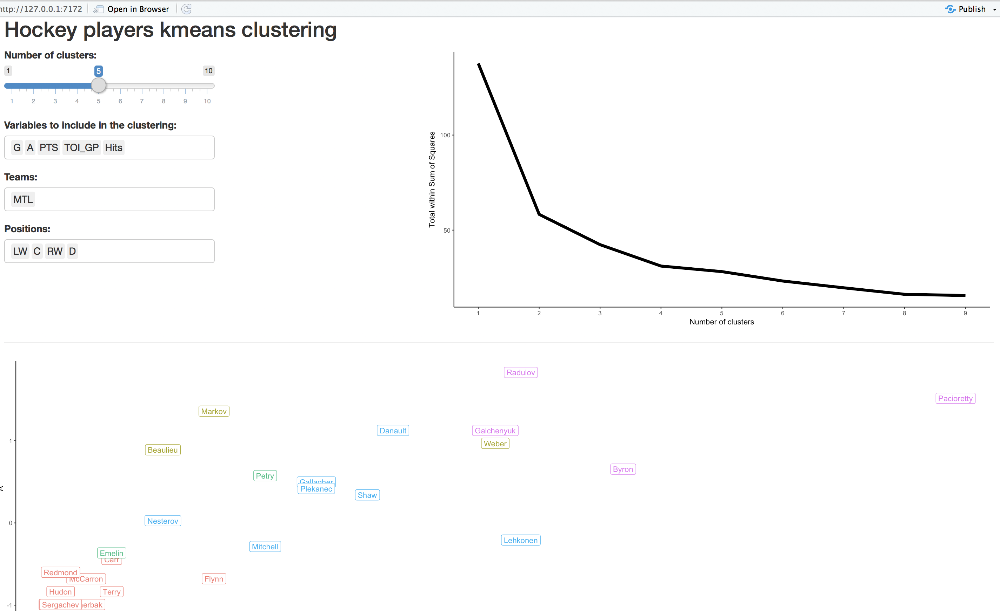

```{r setup, include=FALSE}
knitr::opts_chunk$set(echo = TRUE)
```

## Mise en contexte

Ce projet a été réalisé dans le cadre du programme de "tutorat", mis en place par Christian Larue, entraîneur des Dynamiques du Cégep Sainte-Foy. Le programme a pour but de présenter aux joueurs actuels de l'équipe différents domaines dans lesquels certains anciens joueurs oeuvrent actuellement.

Ce projet spécifique permet de donner une brève introduction aux domaines des mathématiques et statistiques, en plus de toucher à plusieurs concepts en lien avec la programmation et l'analyse de données. Ces concepts peuvent s'appliquer à plusieurs autres domaines, notamment l'informatique et l'actuariat. Pour plus d'informations sur ces domaines en particulier, voici quelques liens pertinents:

Mathématiques et statistiques:

- [Département de mathématiques et statistique de l'Université Laval](https://www.mat.ulaval.ca/accueil/)
- [Data science and statistics jobs](https://hbr.org/2012/10/data-scientist-the-sexiest-job-of-the-21st-century)

Informatique et programmation:

- [Département d'informatique et génie logiciel de l'Université Laval](https://www.ift.ulaval.ca/accueil/)
- [McGill School of Computer Science](https://www.cs.mcgill.ca)
- [Data science and analytics in sports](http://onlinedsa.merrimack.edu/how-data-science-and-analytics-changing-sports/)

Actuariat:

- [École d'actuariat de l'Université Laval](https://www.act.ulaval.ca/accueil/)
- [Society of actuaries](https://www.soa.org/canada/)
- [Casualty actuarial society](http://www.casact.org)

## Description du projet

Comme mentionné dans la section précédente, ce projet consiste en une brève introduction à certaines méthodes statistiques s'appliquant à des problèmes concrèts. Le concept principal introduit dans ce projet s'appelle le "clustering". Le [*clustering*](http://bigdata-madesimple.com/what-is-clustering-in-data-mining/) est une méthode statistique permettant de regrouper des données dans différents groupes partageant des caractéristiques similaires. Il existe plusieurs méthodes de clustering, basées sur différents algorithmes, qui permettent d'obtenir différents résultats dépendemment du contexte. Ces méthodes sont fréquemment utilisées dans plusieurs contextes dans ces différents domaines:

- Marketing:
    - Pour la segmentation de marché et l'analyse de prospects potentiels.
    - Pour la rétention de clients actuels.
    - Pour l'analyse géographique de marchés potentiels.
- Finance:
    - Regroupement d'actions présentant des caractéristiques similaires (gestion de portefeuille).
    - Établissement de caractéristiques pour identifier de potentiels non-payeurs.
- Médecine:
    - Recherche de caractéristiques présents chez un type de patient.

Dans ce projet, nous utiliserons une méthode de clustering précise, la méthode k-means (qui est décrite un peu plus loin), pour établir des styles de joueurs de hockey. En effet, nous utiliserons des statistiques de joueurs de hockey de la LNH (section suivante) pour établir des groupes de joueurs partageant des caractéristiques similaires selon certaines statistiques.

## Description des données

### Jeu de données

Le jeu de données correspond aux statistiques individuelles des joueurs de la LNH pour la saison 2016-2017. Le jeu de données a été extrait sur ce [*site*](http://www.hockeyabstract.com/testimonials/nhl2016-17playerdata). 

### Nettoyage des données

Une étape pratiquement inévitable dans l'analyse de données et dans l'application de la grande majorité des méthodes statistiques consiste a nettoyer les données. Dans notre situation, nous devrons réaliser certaines de ces étapes:

- Sélectionner les données pertinentes
- Corriger certaines données
- Gérer les données manquantes
- Etc

## Méthodologie

Une fois que les données sont nettoyées et prêtes pour l'analyse, il faut maintenant passer à l'étape d'appliquer notre algorithme d'analyse, soit notre algorithme de clustering.

### Méthode k-means

La méthode de clustering introduite dans ce projet se nomme la méthode k-means. Cette méthode se base sur le fait que le nombre de groupes est connu (ou supposé) d'avance. Cela peut paraître contre-intuitif de déterminer un nombre de groupes à l'avance mais nous verrons un peu plus loin qu'il est possible après coup de trouver un nombre de groupes "optimal".

En résumé, l'algorithme fonctionne comme suit:

1. On initialise les groupes, principalement de deux façcons:
    - On associe aléatoirement chacune des données à un groupe.
    - On détermine aléatoirement des valeurs de centroïde (ou valeur centrale) pour chacun des groupes (dans ce cas-ci on passe directement à l'étape 3).
2. On détermine le centroïde de chacun des groupes.
3. Pour chacune des données, on attribue le groupe pour lequel la valeur du centroïde est le plus près* de la donnée. 
4. On réitère les étapes 2 et 3 jusqu'à temps que les groupes ne changent pratiquement plus.

* Pour déterminer quel centroïde est le plus "près", il faut se définir une mesure de distance. Dans le cas le plus fréqeuent, on utilise la distance euclidienne, soit la longueur du trajet entre deux points.

Voici un exemple en deux dimensions qui illustre les étapes décrites un peu plus haut.

#### Étape 0

Voici le jeu de données (example) dont nous voulons appliquer notre méthode de clustering. On remarque rapidement qu'il semble avoir 3 groupes apparents.

```{r etape, echo=FALSE}
library(ggplot2)

set.seed(667)
group1 <- list(x = runif(n = 10, min = 0.8, max = 1), y = runif(n = 10, min = 0.8, max = 1))
group2 <- list(x = runif(n = 10, min = 0.5, max = 0.8), y = runif(n = 10, min = 0.5, max = 0.8))
group3 <- list(x = runif(n = 10, min = 0.3, max = 0.4), y = runif(n = 10, min = 0.3, max = 0.4))
group <- as.factor(sample(x = c(1, 2, 3), size = 10, replace = TRUE))
data <- data.frame(x = c(group1$x, group2$x, group3$x), y = c(group1$y, group2$y, group3$y), groupe = group)

ggplot(data, aes(x = x, y = y)) +
  geom_point() +
  theme(legend.position = "none")
```


#### Étape 1

On initialise l'algorithme. Ici, on attribue aléatoirement chacune des données à un groupe. Dans le cas ci-dessus, en analysant la distribution des données, on commence en définissant 3 groupes (k = 3). 

```{r etape1, echo=FALSE}
ggplot(data, aes(x = x, y = y, color = groupe)) +
  geom_point() +
  theme(legend.position = "none")
```

#### Étape 2

On trouve le centroïde de chacun des groupes (triangle).

```{r etape2, echo=FALSE, message=FALSE, warning=FALSE}
library(dplyr)
centroide <- data %>% group_by(groupe) %>% summarise(x_centroide = mean(x), y_centroide = mean(y))

ggplot(data, aes(x = x, y = y, color = groupe)) +
  geom_point() +
  geom_point(data = centroide, aes(x = x_centroide, y = y_centroide, color = groupe), shape = 17, size = 3) +
  theme(legend.position = "none")
```

#### Étape 3

On associe chaque donnée au groupe pour lequel cette donnée est la plus près du centroïde.

```{r etape3, echo=FALSE}
temp <- data.frame(groupe = rep(NA_integer_, 3), distance = rep(NA_real_, 3))
for (i in 1:nrow(data)){
  for (j in 1:nrow(centroide)){
    temp[j, 1] <- centroide[j, 1]
    temp[j, 2] <- sqrt(sum((data[i,1:2] - centroide[j,2:3])^2))
  }
  data[i, 3] <- temp[which.min(temp[, 2]), 1]
}

ggplot(data, aes(x = x, y = y, color = groupe)) +
  geom_point() +
  geom_point(data = centroide, aes(x = x_centroide, y = y_centroide, color = groupe), shape = 17, size = 3) +
  theme(legend.position = "none")
```

#### Étape 4

On recalcule les valeurs de centroïde pour chacun des groupes nouvellement définis.

```{r etape4, echo=FALSE}
centroide <- data %>% group_by(groupe) %>% summarise(x_centroide = mean(x), y_centroide = mean(y))

ggplot(data, aes(x = x, y = y, color = groupe)) +
  geom_point() +
  geom_point(data = centroide, aes(x = x_centroide, y = y_centroide, color = groupe), shape = 17, size = 3) +
  theme(legend.position = "none")
```

#### Étape 5 

Comme à l'étape 3, on associe chaque donnée au groupe pour lequel cette donnée est la plus près du centroïde.

```{r etape5, echo=FALSE}
temp <- data.frame(groupe = rep(NA_integer_, 3), distance = rep(NA_real_, 3))
for (i in 1:nrow(data)){
  for (j in 1:nrow(centroide)){
    temp[j, 1] <- centroide[j, 1]
    temp[j, 2] <- sqrt(sum((data[i,1:2] - centroide[j,2:3])^2))
  }
  data[i, 3] <- temp[which.min(temp[, 2]), 1]
}

ggplot(data, aes(x = x, y = y, color = groupe)) +
  geom_point() +
  geom_point(data = centroide, aes(x = x_centroide, y = y_centroide, color = groupe), shape = 17, size = 3) +
  theme(legend.position = "none")
```

#### Étape 6

On recommence les deux dernières étapes jusqu'à temps que les groupes soient fixes, soit lorsqu'une itération additionnelle ne provoque aucun changement dans les groupes. Pour déterminer quand il est souhaitable d'arrêter l'algorithme, on peut décider que si les groupes demeurent inchangés aprèes 5 ou 10 itérations, on arrête.

Ce [site](http://www.onmyphd.com/?p=k-means.clustering) constitut un bel example supplémentaire de comment l'algorithme fonctionne à chaque itération.

### Choix du nombre de groupes

Comme mentionné un peu plus tôt, il peut paraître contre-intuitif de définir le nombre de groupes avant même de commencer l'analyse. Dans l'exemple décrit un peu plus haut, il était relativement facile de voir les 3 groupes apparents. Toutefois, il n'est pas toujours aussi aisé de voir de tels groupes ou il peut être difficle de les visualiser dans des situations ayant plus de 2 ou 3 dimensions.

Il existe donc une méthode permettant de "deviner" le nombre de groupes "optimal". Nous avons introduit le clustering comme étant un technique permettant de regrouper certaines données ayant des caractéristiques similaires, mais également ayant des caractéristiques différentes de celles des autres groupes. Il est donc possible de 

### Application aux données de hockey

Dans ce projet, nous utiliserons cet algorithme sur les statistiques individuelles des joueurs de hockey. C'est donc dire que dépendemment du nombre de statistiques inclut dans l'analyse, nous effectuerons le même genre de procédure d'illustré un peu plus haut, mais pas nécéssairement dans un espace à deux dimensions commme illustré dans l'exemple. Par exemple, si nous décidons d'inclure les buts, les passes, les mises en échec et les minutes de pémalités pour construire nos groupes de joueurs, nous travaillerons sur un espace à 4 dimensions (4 statistiques). Le principe de l'algorithme reste le même, il est juste plus difficile de visualiser les étapes une à une.

## Analyse des résultats

Une fois que nous avons nettoyé les données et appliqué notre algorithme (méthode) à ceux-ci, il reste l'étape d'analyser ces résultats. Dans ce projet, nous tenterons de produire un outil flexible qui nous permettra de modifier certains paramètres et d'analyser les résultats selon ceux-ci.

Ainsi, nous bâtierons une application flexible dans laquelle nous insérerons notre algorithme et laisserons le choix à l'utilisateur de modifier certains paramètres comme:

- Le nombre de groupes.
- Les statistiques inclus dans l'analyse (buts, passes, points, mises en échec, etc).
- Les joueurs considérés dans l'analyse (choix de l'équipe).
- Les positions des joueurs analysés à l'intérieur des équipes sélectionnées.

En gros, voici un aperçu du genre d'application que nous bâtierons:



